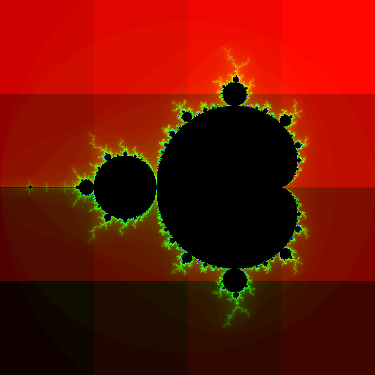

# Part 1: Compilation, running

This page covers how to download, compile, and run the example code.


## Downloading the code

To download the code you will need to clone the repository. To do this execute the following command:

```
git clone https://github.com/EPCCed/EPCC-Exercises
```


## Compiling the code

Enter the directory and compile the code using the Makefile.

{{  '```{include} ../../substitutions/substitutions_REPLACE/Exercise2/ex2_make.md\n```'.replace("REPLACE",machine_name) }}

The compiled program will be called ``fractal``.


## Initial run
The ``fractal`` program is designed to be run in parallel using MPI. If you try and run it in serial it will print an error message:

``./fractal``

```
ERROR: need at least two processes for the task farm!
```

To run using MPI you will need to submit a job to the compute nodes.


The output will look similar to the output below:

```
--------- CONFIGURATION OF THE TASKFARM RUN ---------

Number of processes:			 17
Image size:			 768 x 768 
Task size:			 192 x 192 (pixels)
Number of iterations:		 5000
Coordinates in X dimension:	 -2.000000 to 1.000000
Coordinates in Y dimension:	 -1.500000 to 1.500000
Fractal function is:		 Mandelbrot set

-----Workload Summary (number of iterations)---------

Total Number of Workers: 16
Total Number of Tasks:   16

Total   Worker Load: 498023053
Average Worker Load: 31126440
Maximum Worker Load: 156694685
Minimum Worker Load: 62822

Time taken by 16 workers was 1.212222 (secs)
Load Imbalance Factor: 5.034134


```


The ``fractal`` executable will take a number of parameters and produce a fractal image in a file called ``output.ppm``. By default the image will be
overlaid with blocks in different shades, which correspond to the work done by different processors. This way we can see how the tasks were allocated. An example of this is presented in figure 1 – the image is divided into 16 tasks (squares) and different shade corresponds to each of 16 workers.

{: style="width:500px;height:auto"}

*Example output image created using 16 workers and 16 tasks.*

The default run scripts do the following:

```
srun -n 17 ./fractal -t 192
```

This creates a task farm with one master process and 16 workers. The master divides the image up into tasks, where each task is a square of the size of 192 by 192 pixels. The default image size is 768 x 768 pixels, which means there is exactly one task per worker, i.e. we are not yet doing anything to balance the load. Note that we control the number of tasks through the task size. (``#SBATCH --tasks-per-node=<N>``, or ``srun -n <N>``, or ``mpirun -np <N>``).

The load of a worker is estimated as the total number of iterations of the Mandelbrot calculation summed over all the pixels considered by that worker. The assumption is that the time taken is proportional to this. The only time that is actually measured is the total time taken to complete the calculation.

You can view the output file using ``display output.ppm``, an example of which is found in figure 1. If you want to see how the image looks without the shading use the ``–n`` option to the fractal program - see the following parameter section for more details.

## Fractal program Parameters

The following options are recognised by the fractal program:

- ``-S``  number of pixels in the x-axis of image
- ``-I``  maximum number of iterations
- ``-x`` the x-minimum coordinate
- ``-y`` the y-minimum coordinate
- ``-f <fractal function>`` set to J for Julia set
- ``-c`` the real part of the parameter c+iC for the Julia set
- ``-C`` the imaginary part of the parameter c+iC for the julia set
- ``-t`` task size (pixels x pixels)
- ``-n`` do not shade output image based on task allocation to workers


